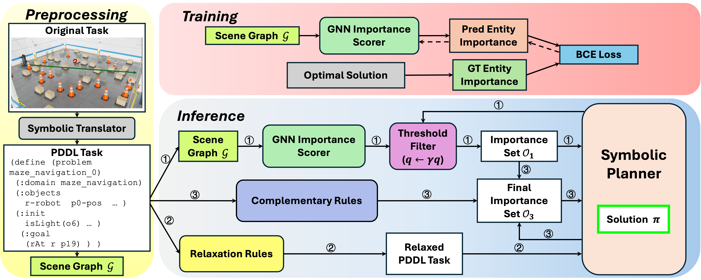
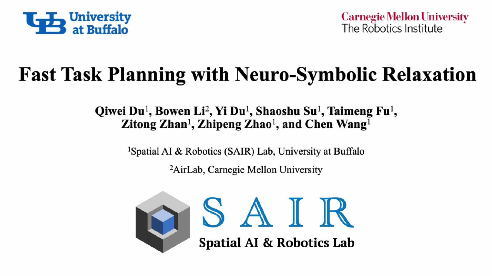
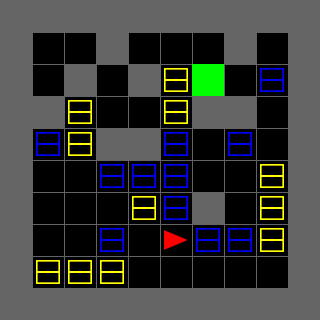

<h1 align="center">Fast Task Planning with Neuro-Symbolic Relaxation</h1><p align="center"><strong>
    <a href = "https://sairlab.org/qiweid/">Qiwei Du</a><sup>1</sup>,
    <a href = "https://jaraxxus-me.github.io/">Bowen Li</a><sup>2</sup>,
    <a href = "https://sairlab.org/yid/">Yi Du</a><sup>1</sup>,
    <a href = "https://sairlab.org/shaoshus/">Shaoshu Su</a><sup>1</sup>,
    <a href = "https://sairlab.org/taimengf/">Taimeng Fu</a><sup>1</sup>,
    <a href = "https://sairlab.org/zitongz/">Zitong Zhan</a><sup>1</sup>,
    <a href = "https://sairlab.org/zhipengz/">Zhiepeng Zhao</a><sup>1</sup>,
    <a href = "https://sairlab.org/chenw/">Chen Wang</a><sup>1</sup>
</strong></p>

<p align="center"><strong>
    <a href = "https://sairlab.org/">1: Spatial AI & Robotics (SAIR) Lab, Computer Science and Engineering, University at Buffalo</a><br>
    <a href = "https://theairlab.org/">2: AirLab, Robotics Institute, Carnegie Mellon University</a><br>

</strong></p>

<p align="center"><strong> 
    <a href = "https://arxiv.org/abs/">&#128196; [Arxiv]</a>
</strong></p>




# Abstract
Real-world task planning requires long-horizon reasoning over large sets of entities with complex relationships and attributes, leading to a combinatorial explosion for classical symbolic planners. To prune the search space, recent methods prioritize searching on a simplified task only containing a few "important" entities predicted by a neural network. However, such a simple neuro-symbolic (NeSy) integration risks omitting critical entities and wasting resources on unsolvable simplified tasks. To enable **F**ast and reliable planning, we introduce a NeSy re**lax**ation strategy (**Flax**), combining neural importance prediction with symbolic expansion. Specifically, we first learn a graph neural network to predict entity importance to create a simplified task and solve it with a symbolic planner. Then, we solve a rule-relaxed task to obtain a quick rough plan, and reintegrate all referenced entities into the simplified task to recover any overlooked but essential elements. Finally, we apply complementary rules to refine the updated task, keeping it both reliable and compact. Extensive experiments are conducted on both synthetic and real-world maze navigation benchmarks where a robot must traverse through a maze and interact with movable objects. The results show that Flax boosts the average success rate by 20.82% and cuts mean wall-clock planning time by 17.65% compared with the state-of-the-art NeSy baseline. We expect that Flax offers a practical path toward fast, scalable, long-horizon task planning in complex environments.

**Video:**


<p align="middle">
<a href="https://youtu.be/_4DYcqwycnQ" target="_blank"></a>
</p>

# Experiments
We propose a task called **Maze Navigation Among Movable Obstacles (MazeNamo)**. In a simplified MiniGrid environment, the scenario consists of a grid-based layout with three types of objects: walls (grey blocks), heavy boxes (blue blocks), and light boxes (yellow blocks). The agent can execute basic navigation actions, including moving forward and turning left or right, as well as three additional manipulative actions: push, pick up, and drop down. The following constraints govern object interactions:

 - Heavy boxes can only be pushed.
 - Light boxes can be both pushed and picked up.
 - Light boxes can be dropped either on the floor or on heavy boxes but cannot be placed on other light boxes.
 - At any given time, the agent can interact with only one box, meaning it cannot push or pick up multiple boxes simultaneously.



# Environment setup

Create conda environment
```
conda create -n flax python=3.10 -y
conda activate flax
pip install -r requirements.txt
```

Add MazeNamo env into Minigrid and install Minigrid
```
bash scripts/create_mazenamo_env.sh
```

# Dataset
The dataset is in `namo_problems`.
Link the training set to `pddlgym`:
```
mkdir pddlgym/pddl
ln -s $(pwd)/namo_domain.pddl $(pwd)/pddlgym/pddl/mazenamo.pddl
ln -s $(pwd)/namo_problems/pddl_10x10_train $(pwd)/pddlgym/pddl/mazenamo
```

## MazeNamo problem generation (optional)
You can also generate new datasets using:
```
python src/generate_mazenamo_problems.py
```
where problem size and problem difficulty can be changed.

# Install the plan validation tool
```
bash scripts/install_VAL.sh
```

# Train and test
Trained models are reused in batch scripts.  
All experiments use models trained on 200 10x10 problems. 
(If training hasn't been run before, weights will appear in `model/`. If `model/` already exists, training will be skipped.)
```
# run experiments with one group of settings
bash scripts/run.sh

# run experiments with multiple groups of settings
bash scripts/batch_run.sh
```

# MiniGrid Visualization
```
# generate .gif for a specific problem or all the problems of a certain group of settings
bash scripts/batch_vis.sh
```

# Isaac Sim Experiments
## Install Isaac Sim
```
pip install isaacsim[all]==4.5.0 --extra-index-url https://pypi.nvidia.com
pip install usd-core  # named pxr when importing, used to handle usd files
```

## Download assets
Download usd files here:
```
https://drive.google.com/file/d/1Jg4G-aZOua9H5BjGLgwRbY28F0TyK66f/view?usp=sharing
```

The file structure should be:
```
flax/
├── assets/
│   ├── Collected_Box_A09_40x30x23cm_PR_V_NVD_01/
│   ├── Collected_...
│   ├── 2x2_warehouse_shapes.npy
│   ├── 2x2_warehouse_base_0.usd
│   └── ...
└── ...
```

## Visualize a .usd file (optional)
First run:
```
python src/run_isaacsim_gui.py
```
Then, choose a .usd file in the GUI.

## Generate your customized warehouse shape in Isaac Sim (optional)
For simplicity, we only used a 2x2 square warehouse as the base scene in our experiments (`assets/2x2_warehouse_shapes.npy`).
However, you can generate unique warehouse shapes using `generate_random_warehouse()` in `src/generate_isaacsim_warehouse_shape.py`, change the path of `warehouse_shapes` and run:
```
python src/generate_isaacsim_warehouse_base_scene.py
```
if you have customized requirements. You will get a .usd file of an empty warehouse (something like `assets/2x2_warehouse_base_0.usd`).

## Generate a MazeNamo scene in Isaac Sim
Generate from a grid map in `namo_problems/`:
```
python src/generate_isaacsim_scene_from_grid_map.py
```
Generate from a handcrafted scene:
```
python src/generate_isaacsim_scene_example.py
```

## Solve the MazeNamo problem in Isaac Sim using Forklift
Remember to set the initial robot direction in `solve_isaacsim_mazenamo_from_usd_forklift.py` according to the output info of `generate_isaacsim_scene_from_grid_map.py`.
```
python src/solve_isaacsim_mazenamo_from_usd_forklift.py
```
(Note: Rendering on the RTX 4090 GPU currently supports only 10×10 and 12×12 maps. Scaling up to a 15×15 map requires a 3×3 warehouse configuration; however, rendering the full scene sometimes exceeds the available GPU memory.)


# Code base
Parts of this repository are derived from https://github.com/tomsilver/ploi and https://github.com/tomsilver/pddlgym. Many thanks to the original authors for sharing their code.

## Publications

If you our code in your own work, please cite:

```

```